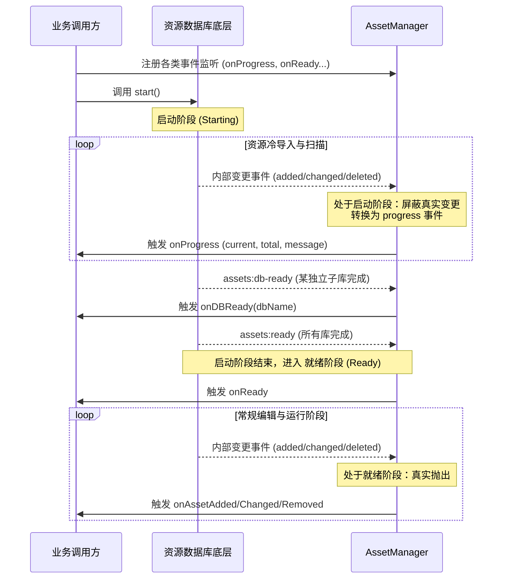

# Assets 模块事件时序说明

本文档旨在说明 `Assets` 模块在不同生命周期阶段（启动、就绪、运行中）各个监听回调的触发时机和使用注意事项，以保障上层业务逻辑的稳定。

## 生命周期阶段

资产系统（Asset Database）的生命周期主要分为两个阶段：
1. **启动阶段 (Starting)**：从调用 `start()` 开始，到所有资源扫描、冷导入完成。
2. **就绪阶段 (Ready)**：所有资源已完成初始加载，系统进入监听和正常服务状态。

### 时序图说明



---

## 核心监听回调说明

### 1. 进度监听：`onProgress`
- **注册方式**：`import { assets } from 'cocos-cli'; assets.onProgress((current, total, message) => { ... });`
- **触发时机**：仅在**启动阶段**触发。当底层资源数据库在进行资源扫描和冷导入时，会不断抛出进度信息。
- **注意事项**：
  - 一旦触发过一次 `ready` 事件（即启动阶段结束），**将不再会有新的进度消息**，除非系统被重新启动。
  - 上层 UI（如启动加载条）应该在此事件中更新进度，并在收到 `ready` 事件后销毁或隐藏进度条。
  - 由于进度消息可能非常密集，建议在 UI 层面进行适当的节流（throttle）渲染。

### 2. 单数据库就绪监听：`onDBReady`
- **注册方式**：`import { assets } from 'cocos-cli'; assets.onDBReady((dbName) => { ... });`
- **触发时机**：当某个独立的资源数据库（例如 `assets` 或 `internal`）单独启动完成并准备就绪时触发。
- **注意事项**：
  - 这个事件可能会被触发多次（如果项目存在多个子数据库）。
  - 主要用于需要做更精细化并行控制的上层逻辑，通常情况下普通的业务逻辑不需要关心此事件，直接监听 `onReady` 即可。

### 3. 全局就绪监听：`onReady`
- **注册方式**：`import { assets } from 'cocos-cli'; assets.onReady(() => { ... });`
- **触发时机**：**启动阶段**结束时触发，代表**所有**注册的资源数据库都已经完全导入并初始化完成。
- **注意事项**：
  - 收到此事件后，表示所有的资源查询、操作 API 都可以安全调用，并且之后发生的资源变化将通过 `onAssetChanged` 等事件通知。

### 4. 资源变更监听：`onAssetAdded`, `onAssetChanged`, `onAssetRemoved`
- **注册方式**：通过 `assets.on(...)` 注册。
- **触发时机**：仅在**就绪阶段**（`ready` 状态为 `true` 后）才会对外触发。
- **注意事项**：
  - **在启动阶段，这三个事件是无效的（被屏蔽的）**。这是因为启动时的批量冷导入会导致极其频繁的添加、修改操作，如果此时触发事件，会导致上层逻辑处理过载甚至引起死循环。
  - 在启动阶段发生的资源变动，已经被转换为 `onProgress` 进度消息。只有在收到 `onReady` 事件之后发生的增删改查，才会通过这些事件真实地抛出给外部。

---

## 最佳实践示例

```typescript
import { assets } from 'cocos-cli';

// 1. 注册进度监听（展示 Loading）
const removeProgress = assets.onProgress((current, total, message) => {
    console.log(`[Loading] ${current}/${total} - ${message}`);
    // 更新 UI ...
});

// 2. 注册 Ready 监听（隐藏 Loading，开始正常业务）
const removeReady = assets.onReady(() => {
    console.log('[Assets] All databases are ready!');
    
    // 启动阶段结束，可以清理进度监听了
    removeProgress();
    
    // 3. 在 Ready 之后，再进行常规的资源变更监听（或者在模块初始化时注册也没关系，反正 Ready 前不会触发）
    assets.on('onAssetAdded', (info) => {
        console.log(`New asset added: ${info.url}`);
    });
});

// 最后调用 start()
await assets.start();
```
