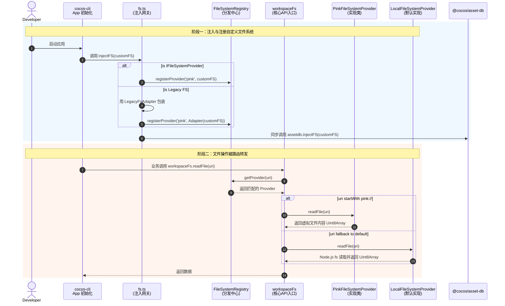

# 虚拟文件系统注入 (Filesystem Injection)

为了支持外部环境（如 PinK 系统）使用自定义的文件操作对象，并剥离底层资源系统对真实操作系统的强依赖，`cocos-cli` 提供了一套文件系统注入的机制，并在最新的架构中演进为了基于协议的 `FileSystemProvider` 机制。

## 机制说明

### 1. IFileSystemProvider 与 fsRegistry

`cocos-cli` 设计了类似于 VS Code 的 `IFileSystemProvider` 接口。核心思想是：将各种不同的环境（本地磁盘 Node.js、浏览器 IndexedDB、内存虚拟文件系统、远程拉取等）抽象为标准的 API 契约（如 `readFile`, `stat`, `writeFile`）。

系统内通过 `fsRegistry` (FileSystemRegistry) 管理各种协议头（scheme，如 `file://`, `pink://` 等）到不同 Provider 的映射关系。

全局工具对象 `workspaceFs` 提供了通用的接口，在内部会根据传入 URI 的前缀，自动将调用路由（Route）给对应的 FileSystemProvider 处理。默认情况下，`workspaceFs` 使用 `LocalFileSystemProvider` 操作本地磁盘。

### 2. 兼容层 (Proxy 注入)

考虑到存量代码依然充斥着大量的原生 `fs-extra` 和 `fs` 库的调用，我们并没有立刻全部强行替换。相反，我们在 `src/core/filesystem/fs.ts` 中保留了 Proxy 的代理层。

当你在外部调用 `injectFS()` 注入一个自定义对象时：
1. **如果是实现了 `IFileSystemProvider` 标准的对象**，它会被直接注册进 `fsRegistry`。
2. **如果是传统的 `fs` 对象**，内部使用 `LegacyFsAdapter` 适配器将传统同步和异步函数打包成符合 `IFileSystemProvider` 的异步接口并注册。
3. 仍然会同步注入到底层的 `@cocos/asset-db` 中，确保底层资源库也能受到接管。

## 拦截与注入机制图解

通过下面的时序图，可以直观地了解新的 Provider 机制是如何工作的：



## 使用方法

### 1. 注入自定义文件系统

如果需要接管文件系统操作（比如对接至虚拟内存中的文件系统、或接管网络文件系统），我们需要在程序的极其早期（资源模块启动前、或者 CLI 初始化时）执行注入调用：

```typescript
import { injectFS } from '../../core/filesystem/fs';
// 假设这里是你写的外部自定义文件系统对象
import myVirtualFS from 'my-virtual-fs';

// 执行全局注入
injectFS(myVirtualFS);
```

### 2. 实现 IFileSystemProvider

推荐直接实现 `IFileSystemProvider` 标准接口，这样可以让代码更具有通用性和未来兼容性：

```typescript
import { IFileSystemProvider, FileType, FileStat } from 'cocos-cli/core/filesystem';

class MyMemoryFileSystemProvider implements IFileSystemProvider {
    private files = new Map<string, Uint8Array>();

    async exists(uri: string): Promise<boolean> {
        return this.files.has(uri);
    }

    async stat(uri: string): Promise<FileStat> {
        if (!this.files.has(uri)) throw new Error('File not found');
        return {
            type: FileType.File,
            ctime: Date.now(),
            mtime: Date.now(),
            size: this.files.get(uri)!.length
        };
    }

    async readFile(uri: string): Promise<Uint8Array> {
        if (!this.files.has(uri)) throw new Error('File not found');
        return this.files.get(uri)!;
    }

    // ... 实现其他接口如 writeFile, delete 等
}

// 实例化并注入
const myProvider = new MyMemoryFileSystemProvider();
injectFS(myProvider);
// 此时系统将能识别 pink:// 等相关协议（或替换掉默认行为，取决于内部配置机制）
```

## 注意事项与约束

- **从同步向异步迁移**：虽然兼容层（LegacyFsAdapter 和 Proxy）能在一定程度上继续支持 `readFileSync` 之类的旧有调用，但在对接真实的 VFS（如 VSCode 或 Web 环境）时往往只有异步 I/O 可用。我们正在逐渐将业务层的 I/O 调用迁移至 `workspaceFs` 异步接口，外部扩展尽量遵循 `IFileSystemProvider` 的异步规范。
- **关于 Watcher**：目前在某些操作中如果底层仍依赖操作系统的 `chokidar` 或者 `fs.watch` 进行文件变更的轮询/监听，如果你使用了完整的虚拟文件系统，建议在外部通过 `injectFS` 覆盖对应的侦听器生成方法为空，然后通过内部的精准变动事件接口去主动通知资源系统的刷新。
- **向下传染**：调用 `injectFS` 不光会影响 `cocos-cli` 自己的层级调用，它内部默认也会去触发 `@cocos/asset-db` 的 `injectFS`。
