# cocos-cli Animation Graph 数据结构

> 本文档梳理 cocos-cli 中与 **Animation Graph（动画图）** 相关的全部数据结构，使用 Mermaid UML 图描述类型关系，并在各节配以字段速查表。
>
> - 类型层（TypeScript `.d.ts`）：`src/core/assets/@types/public.d.ts`
> - 服务层：`src/core/assets/animation-graph-service.ts`、`src/core/assets/animation-graph-variant.ts`
> - 处理器层：`src/core/assets/asset-handler/assets/animation-graph.ts`、`animation-graph-variant.ts`
> - API Schema：`src/api/assets/schema.ts`

---

## 1. 概览

### 1.1 相关代码文件

| 文件 | 角色 |
|------|------|
| `src/core/assets/@types/public.d.ts` | 公共类型定义（版本、寻址、视图快照、命令、Inspector） |
| `src/core/assets/animation-graph-service.ts` | 动画图编辑服务（文档缓存、查询、命令执行、Inspector） |
| `src/core/assets/animation-graph-variant.ts` | 动画图变体服务（解读 / 修改 / 保存变体资产） |
| `src/core/assets/asset-handler/assets/animation-graph.ts` | `.animgraph` 资源处理器（importer `animation-graph`） |
| `src/core/assets/asset-handler/assets/animation-graph-variant.ts` | `.animgraphvari` 资源处理器（importer `animation-graph-variant`） |
| `src/api/assets/schema.ts` | Zod 校验 Schema（变体 dump 的 API 参数/结果契约） |

### 1.2 组件总览图

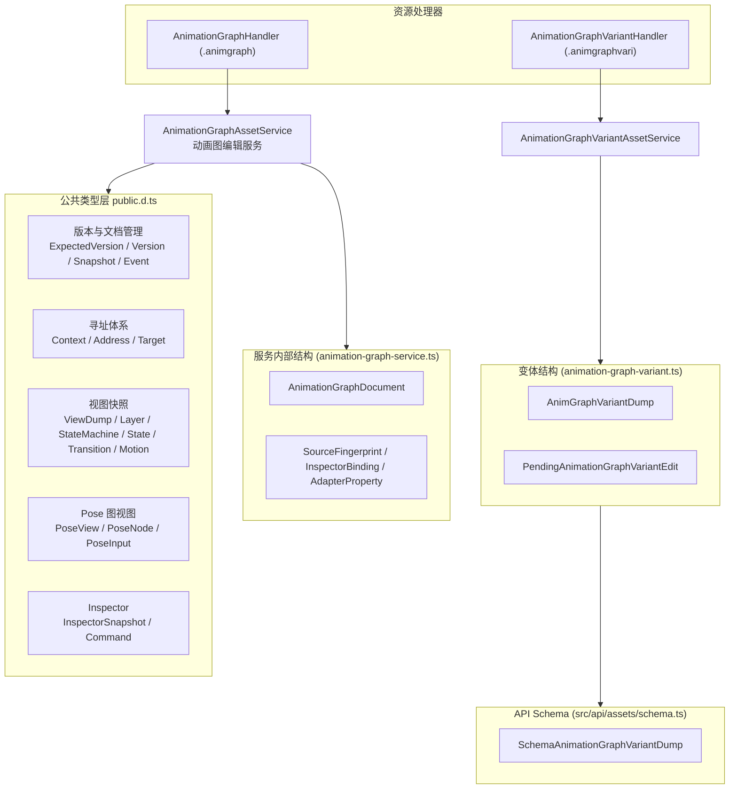

---

## 2. 公共类型层（public.d.ts）

### 2.1 版本与文档管理

`AnimationGraphExpectedVersion` 是乐观并发控制的最小单元；`AnimationGraphVersion` 追加持久化 / 脏标记状态；`AnimationGraphSnapshot` 是 `query` / `execute` / `save` / `reload` 返回的统一快照。`AnimationGraphChangedEvent` 用于向监听者广播变更。

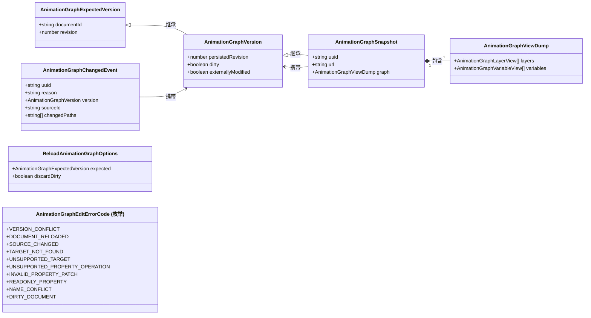

**字段速查**

| 类型 | 字段 | 类型 | 说明 |
|------|------|------|------|
| `AnimationGraphExpectedVersion` | `documentId` | `string` | 文档唯一 ID（每次加载重新生成） |
| | `revision` | `number` | 已提交修改的版本号 |
| `AnimationGraphVersion` | `persistedRevision` | `number` | 已持久化版本号 |
| | `dirty` | `boolean` | 是否有未保存修改 |
| | `externallyModified` | `boolean` | 源文件是否被外部改动 |
| `AnimationGraphSnapshot` | `uuid` / `url` | `string` | 资产标识 |
| | `graph` | `AnimationGraphViewDump` | 完整视图快照 |
| `AnimationGraphChangedEvent` | `reason` | `'inspector' \| 'structure' \| 'save' \| 'reload' \| 'external'` | 变更原因 |
| | `sourceId?` / `changedPaths?` | `string` / `string[]` | 变更来源与路径 |

---

### 2.2 寻址体系：Context / Address / Target

动画图由 **Layer（层）→ StateMachine（状态机）→ State（状态）/ Transition（过渡）→ Motion（动作）**，以及独立的 **Pose Graph（姿态图）→ PoseNode + 内嵌状态机** 组成。为了让 Inspector / 命令能够唯一定位任意节点，cocos-cli 定义了一套**上下文 → 地址 → 目标**的三角寻址体系。

> 说明：图中的继承箭头表示「类型组合/扩展」关系（TypeScript 交叉类型语义），`note` 块给出判别联合（discriminated union）的 `kind` 成员。

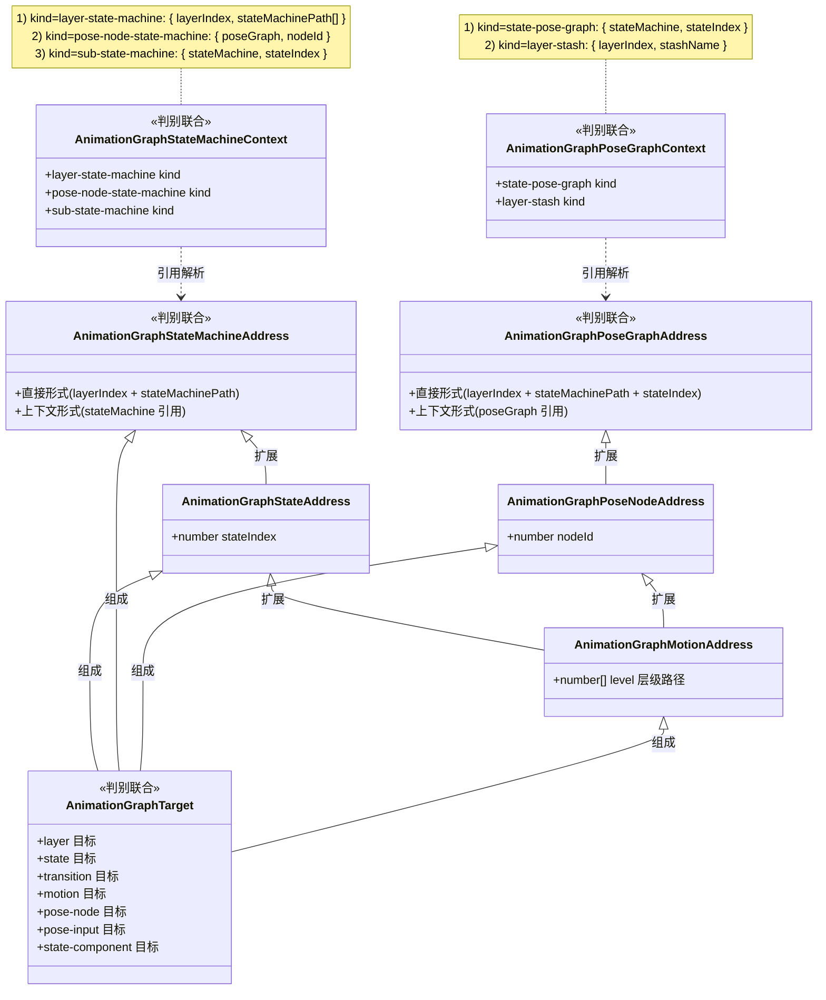

**字段速查（关键联合成员）**

| 类型 | 成员 | 结构 |
|------|------|------|
| `AnimationGraphStateMachineContext` | `layer-state-machine` | `{ kind, layerIndex, stateMachinePath: number[] }` |
| | `pose-node-state-machine` | `{ kind, poseGraph, nodeId }` |
| | `sub-state-machine` | `{ kind, stateMachine, stateIndex }` |
| `AnimationGraphPoseGraphContext` | `state-pose-graph` | `{ kind, stateMachine, stateIndex }` |
| | `layer-stash` | `{ kind, layerIndex, stashName }` |
| `AnimationGraphTarget` | `layer` | `{ kind, layerIndex }` |
| | `state` | `{ kind } & StateAddress` |
| | `transition` | `{ kind, transitionIndex } & StateMachineAddress` |
| | `motion` | `{ kind } & MotionAddress` |
| | `pose-node` | `{ kind } & PoseNodeAddress` |
| | `pose-input` | `{ kind, inputId } & PoseNodeAddress` |
| | `state-component` | `{ kind, componentIndex } & StateAddress` |

---

### 2.3 视图快照体系

服务端将引擎运行时对象投影为**只读视图（View）**，供 Webview / Inspector 消费。树形关系如下：

- `AnimationGraphViewDump`（整图）→ 多个 `LayerView`
- `LayerView` → `StateMachineView`；`StateMachineView` → 多个 `StateView` 与 `TransitionView`
- `StateView` 可递归内嵌 `StateMachineView`（子状态机）、携带 `MotionView`（动作状态）、或挂 `PoseView`（过程姿态状态）
- `MotionView` 递归包含子 `MotionView`（1D/2D 混合）

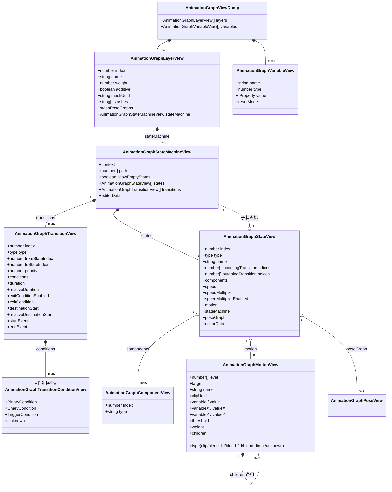

**字段速查**

| 类型 | 关键字段 |
|------|---------|
| `AnimationGraphViewDump` | `layers[]`、`variables[]` |
| `AnimationGraphLayerView` | `index`、`name`、`weight`、`additive`、`maskUuid: string\|null`、`stashes: string[]`、`stashPoseGraphs[]`、`stateMachine` |
| `AnimationGraphStateMachineView` | `context`、`path: number[]`、`allowEmptyStates`、`states[]`、`transitions[]`、`editorData?` |
| `AnimationGraphStateView` | `index`、`type`（`entry/exit/any/motion/empty/sub-state-machine/procedural-pose/unknown`）、`name`、`incoming/outgoingTransitionIndices[]`、`components[]`、`speed?`、`speedMultiplier?`、`speedMultiplierEnabled?`、`motion?`、`stateMachine?`、`poseGraph?`、`editorData?` |
| `AnimationGraphTransitionView` | `index`、`type`（`animation/empty-state/procedural-pose/transition`）、`fromStateIndex`、`toStateIndex`、`priority`、`conditions[]`、`duration?`、`relativeDuration?`、`exitConditionEnabled?`、`exitCondition?`、`destinationStart?`、`relativeDestinationStart?`、`startEvent?`、`endEvent?` |
| `AnimationGraphTransitionConditionView` | 判别联合：Binary / Unary / Trigger / Unknown，见下 |
| `AnimationGraphComponentView` | `index`、`type` |
| `AnimationGraphMotionView` | `level[]`、`target`、`type`、`name`、`clipUuid?`、`variable?/value?`、`variableX?/valueX?`、`variableY?/valueY?`、`threshold?`、`weight?`、`children?`、`editorData?` |
| `AnimationGraphVariableView` | `name`、`type: number`、`value: IProperty`、`resetMode?: number`（Trigger 类型才有） |

**过渡条件（TransitionConditionView）判别联合成员**

| `type` | 字段 |
|--------|------|
| `BinaryCondition` | `index`、`operator`、`lhs`、`lhsBinding`、`bindingClass`、`rhs`、`isRhsInteger` |
| `UnaryCondition` | `index`、`operator`、`operand` |
| `TriggerCondition` | `index`、`trigger` |
| `Unknown` | `index`、`className` |

---

### 2.4 Pose 图视图体系

Pose 图是一张**节点连通图**：根输出节点引出，节点间通过输入/输出端口相连；节点可内嵌状态机或动作（Motion），也可以作为 Stash 入口。

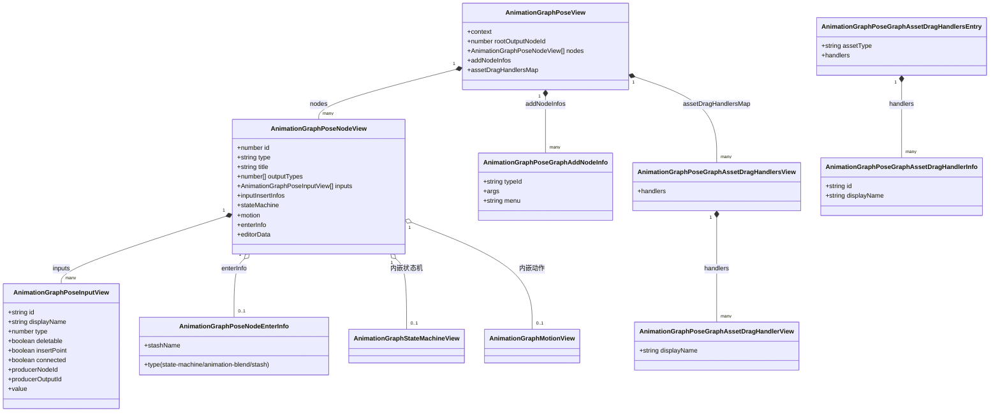

**字段速查**

| 类型 | 关键字段 |
|------|---------|
| `AnimationGraphPoseView` | `context`、`rootOutputNodeId: number`、`nodes[]`、`addNodeInfos[]`、`assetDragHandlersMap` |
| `AnimationGraphPoseNodeView` | `id`、`type`、`title`、`outputTypes: number[]`、`inputs[]`、`inputInsertInfos`、`stateMachine?`、`motion?`、`enterInfo?`、`editorData?` |
| `AnimationGraphPoseInputView` | `id`、`displayName`、`type`、`deletable`、`insertPoint`、`connected`、`producerNodeId?`、`producerOutputId?`、`value?: IProperty` |
| `AnimationGraphPoseNodeEnterInfo` | `type: 'state-machine' \| 'animation-blend' \| 'stash'`、`stashName?` |
| `AnimationGraphPoseGraphAddNodeInfo` | `typeId`、`args: unknown`、`menu`（面包屑式路径） |
| `AnimationGraphPoseGraphAssetDragHandlersView/Entry` | `handlers`（按 handlerId 索引） / `assetType + handlers[]` |

---

### 2.5 Inspector 快照与命令

Inspector 通过「目标 + 属性路径」读写属性；每次操作都携带 `expected` 版本做乐观并发控制。

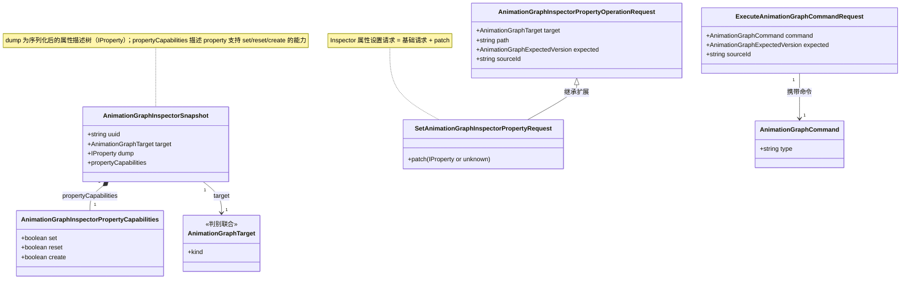

**字段速查**

| 类型 | 说明 |
|------|------|
| `AnimationGraphInspectorSnapshot` | `uuid`、`target`、`dump: IProperty`、`propertyCapabilities?` |
| `AnimationGraphInspectorPropertyCapabilities` | `set` / `reset` / `create: boolean` |
| `AnimationGraphInspectorPropertyOperationRequest` | `target`、`path`、`expected`、`sourceId?` |
| `SetAnimationGraphInspectorPropertyRequest` | 基础请求 + `patch: IProperty \| unknown` |
| `ExecuteAnimationGraphCommandRequest` | `command`、`expected`、`sourceId?` |

---

### 2.6 命令体系：AnimationGraphCommand

`AnimationGraphCommand` 是**按 `type` 判别的大型联合类型**，覆盖 Layer / State / Transition / Motion / StateComponent / Pose / Variable / Stash 的增删改。所有命令通过 `execute()` 在服务端执行，并推进文档 `revision`。

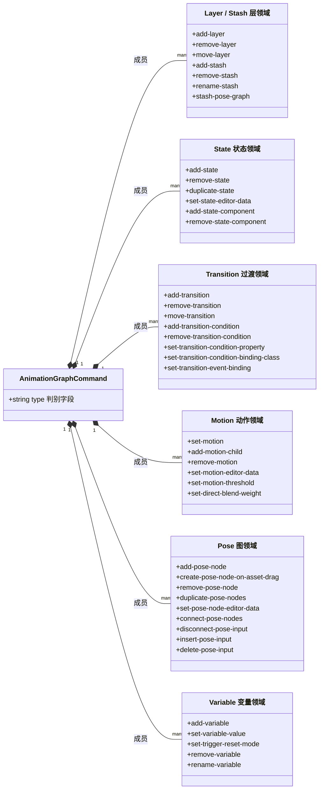

> 大多数命令在 `type` 之外还内联携带**状态机地址（StateMachineAddress）** 或 **目标（Target）**，例如 `add-state`、`add-transition`、`connect-pose-nodes` 等；地址解析逻辑复用第 2.2 节的寻址体系。

**相关类型别名**

| 别名 | 取值 |
|------|------|
| `AnimationGraphStateType` | `'motion' \| 'empty' \| 'sub-state-machine' \| 'procedural-pose'` |
| `AnimationGraphMotionType` | `'clip' \| 'blend-1d' \| 'blend-2d' \| 'blend-direct'` |
| `AnimationGraphTransitionConditionType` | `'binary' \| 'unary' \| 'trigger'` |

---

### 2.7 AnimationMask（动画掩码）

Layer 的 `maskUuid` 指向一张动画掩码资产，其 dump 结构如下：

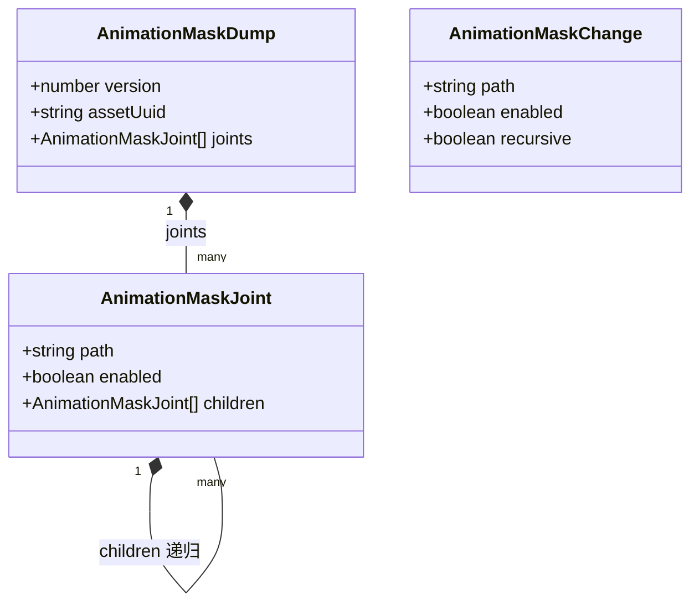

---

## 3. 服务内部数据结构（animation-graph-service.ts）

服务以「文档」为核心缓存：对每个动画图资产维护一个 `AnimationGraphDocument`，内部处理版本并发、外部写入检测（指纹对比）、节点 ID 分配与变更事件广播。

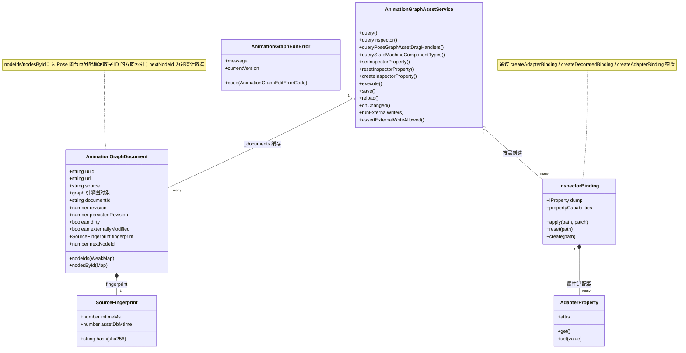

**关键说明**

| 结构 | 说明 |
|------|------|
| `AnimationGraphDocument` | 内存中的可编辑图文档；`graph` 是引擎反序列化后的对象树；`nodeIds`/`nodesById` 为 Pose 图节点分配稳定 ID；每次落盘成功会刷新 `fingerprint` |
| `SourceFingerprint` | 源文件 `sha256` + `mtimeMs` + 资源库 mtime，用于检测外部修改（`externallyModified`） |
| `InspectorBinding` | 绑定到具体目标（Layer/State/Transition/Motion/PoseNode/PoseInput/StateComponent）的属性读写职责 |
| `AdapterProperty` | 属性 getter/setter + 描述元数据（`attrs`），供编码为 `IProperty` dump |
| `AnimationGraphEditError` | 编辑异常，携带可枚举错误码（见 2.1 `AnimationGraphEditErrorCode`） |

---

## 4. 动画图变体（animation-graph-variant.ts）

动画图变体在引用一个动画图的基础上，覆写其中的**动画片段（clip）**，形成可复用的资源变体。

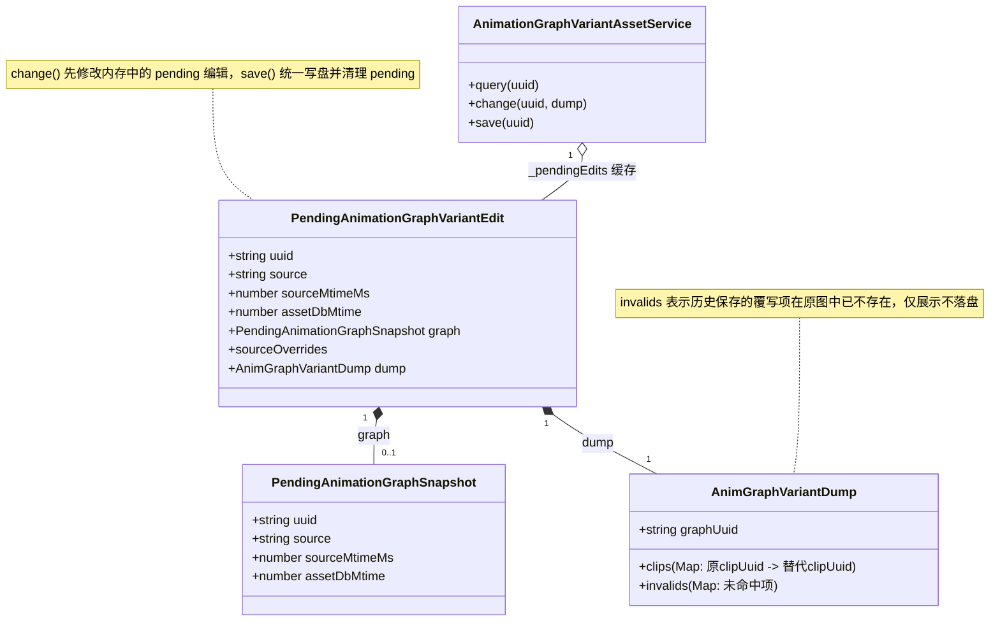

**API Schema（src/api/assets/schema.ts）**

| Zod Schema | 对应类型 | 说明 |
|-----------|---------|------|
| `SchemaAnimationGraphVariantDump` | `TAnimationGraphVariantDump` | 变体可编辑 dump：`graphUuid`（可空）、`clips`（覆写映射，空串表示无覆写）、`invalids?`（仅展示） |
| `SchemaAnimationGraphVariantResult` | `TAnimationGraphVariantResult` | `query` / `change` 的返回 |
| `SchemaAnimationGraphVariantSaveResult` | `TAnimationGraphVariantSaveResult` | `save` 的返回（恒为 `null`） |

---

## 5. 资源处理器（asset-handler）

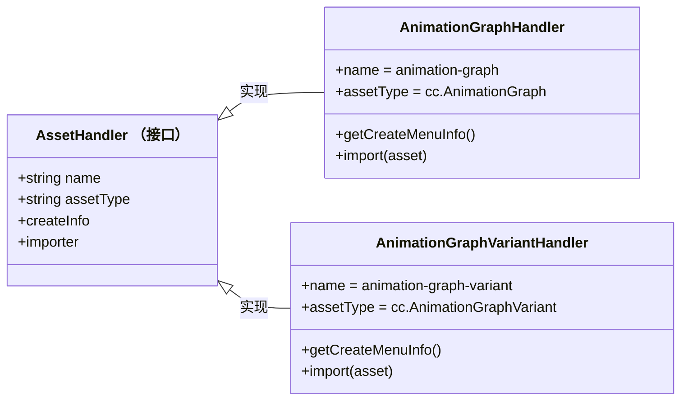

| 处理器 | 扩展名模板 | importer | assetType |
|--------|-----------|----------|-----------|
| `AnimationGraphHandler` | `Animation Graph.animgraph`（模板 `default.animgraph`） | `animation-graph`（版本 `1.2.0`） | `cc.AnimationGraph` |
| `AnimationGraphVariantHandler` | `Animation Graph Varint.animgraphvari` | `animation-graph-variant`（版本 `1.0.0`） | `cc.AnimationGraphVariant` |

两者的 `import()` 均读取源 JSON，原样写入 library（`.json`），并抽取依赖 UUID 列表（`getDependUUIDList`）。

---

## 6. 整体关系一览

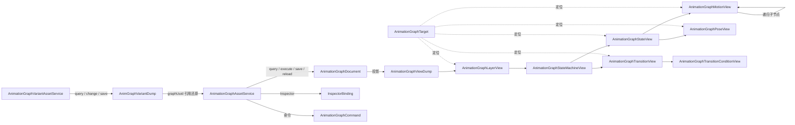